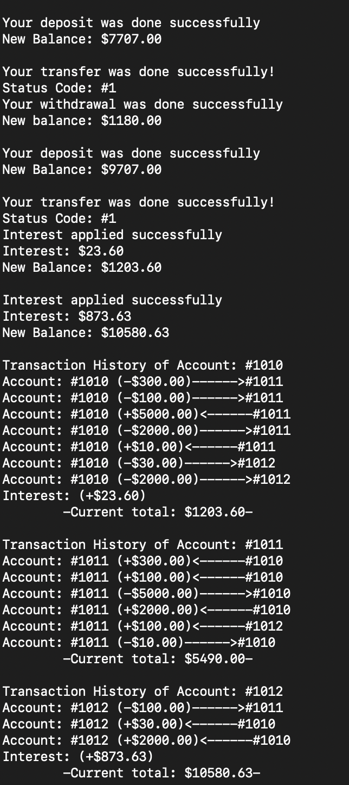

# Bank System
A C++ program simulating bank accounts with deposits, withdrawals, transfers, and interest calculations.

## Features
-  Create accounts with initial balances and interest rates.
-  Perform deposits, withdrawals, and transfers (e.g., $2000 from "1010" to "1012").
-  Track transaction histories using vectors.
-  Apply interest to savings accounts (2% for #1010, 9% for #1012).

## Purpose
Developed as part of my C++ learning journey to master object-oriented programming (OOP) concepts, including encapsulation, polymorphism, and vector usage. This project builds on my earlier work, like `RestaurantInheritance`, to simulate real-world banking operations.

## Files 
- **Source Files** (`src/`):
  - `mainBankAccount.cpp`: Main program logic to test account operations.
  - `fns_BankAccount.cpp`: Implementation of account and transaction methods.
 
- **Header Files** (`include/`):
  - `h_BankAccount.hpp`: `BankAccount` class declaration.
  - `h_classBank.hpp`: `Bank` class for account management.

## How to run
```bash
g++ src/mainBankAccount.cpp src/fns_BankAccount.cpp -I include -o bank
./bank
```

# Sample Output 
### Account Creation
- Account #1010 created with balance: $5000.00, Interest rate: 2%
- Account #1012 created with balance: $3000.00, Interest rate: 9%

### Transactions
- Deposit to #1010: $1000.00
- New balance for #1010: $6000.00

- Withdrawal from #1012: $500.00
- New balance for #1012: $2500.00

- Transfer from #1010 to #1012: $2000.00

- New balance for #1010: $4000.00
- New balance for #1012: $4500.00

### Interest Application
- Applying interest for #1010 (2%): $80.00
  -New balance for #1010: $4080.00

- Applying interest for #1012 (9%): $405.00
  -New balance for #1012: $4905.00


### Transaction History Screenshot 


## Learning Outcomes
- Applied OOP concepts like encapsulation (private account data) and polymorphism (virtual transaction methods).
- Used vectors to store dynamic transaction histories.
- Implemented real-world banking logic with interest calculations and transfers.
- Improved project organization with src/ and include/ folders

## Author
Rodrigo Casio ([View my GitHub profile](https://github.com/rodrigcasio))
