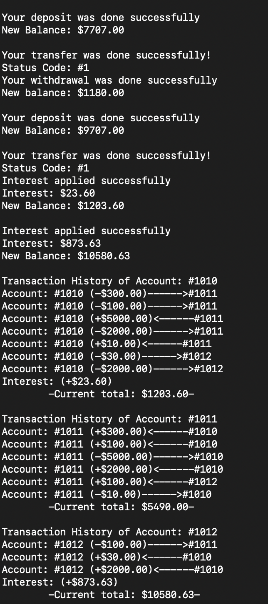

# Bank System (C++)

This is a C++ project I made to practice object-oriented programming (OOP) and to build something a bit more complete. The program simulates a simple bank system where you can create accounts, deposit and withdraw money, transfer funds, and apply interest. I put extra effort into this one to really understand how to organize a bigger project.

## Features
-  Create accounts with initial balances and interest rates.
-  Perform deposits, withdrawals, and transfers (e.g., $2000 from "1010" to "1012").
-  Track transaction histories using vectors.
-  Apply interest to savings accounts (2% for #1010, 9% for #1012).

## Purpose

I made this project to get better at using classes, vectors, and OOP ideas in C++. I wanted to see if I could put together a small system that feels more like a real application, and learn how to manage more code and features.

## How to Run
This project uses **CMake** build system generator for easy, cross-platform compilation. Follow these steps from the root directory of the project `BankSystem/`

1. **Ensure CMake is installed:**
- Make sure you have CMake (version 3.1- or higher please) and a C++ compiler (g++ or clang++) installed on your system.

2. **Generate the build system (configure):**
- Create a separated directory for the build files  and run CMake inside it. Keeping source files clean

```bash
mkdir build
cd build
cmake ..
```

3. **Build:**
- Use generated build system (`make` on Unix-like systems) to compile the executable.

```bash 
make
```

4. **Run the program:**
- The executable (BankSystem) will be placed inside the `build` directory.

```bash 
./BankSystem
```

**IMPORTANT: Note for windows users:**

- Windows developers have two ways to build the project using CMake.
  - **Command line (MSYS2/Cygwin):** If you use an environment like **MSYS2** or **WLS** (Windows Subsystem for Linux), you can follow the **Standard Build** steps above exactly.
  - **Visual Studio:** CMake can generate a Visual Studio solution. Run CMake from your `developer command prompt`, specify the generator:

```bash 
cmake .. -G "Visual Studio 17 2022"
```

Then, open the generated `.sln` file and build within Visual Studio IDE.

## Sample Output

### Account Creation
- Account #1010 created with balance: $5000.00, Interest rate: 2%
- Account #1012 created with balance: $3000.00, Interest rate: 9%

### Transactions
- Deposit to #1010: $1000.00
- New balance for #1010: $6000.00

- Withdrawal from #1012: $500.00
- New balance for #1012: $2500.00

- Transfer from #1010 to #1012: $2000.00

- New balance for #1010: $4000.00
- New balance for #1012: $4500.00

### Interest Application
- Applying interest for #1010 (2%): $80.00
  -New balance for #1010: $4080.00

- Applying interest for #1012 (9%): $405.00
  -New balance for #1012: $4905.00

### Transaction History Screenshot 


## What I Learned

- How to use classes and private data to keep things organized and safe.
- How to use vectors to store lists of transactions that can grow as needed.
- How to use inheritance and virtual methods for different types of accounts or actions.
- How to split code into different files and keep things tidy with `src/` and `include/` folders.
- How to build a project that feels more like a real-world application, not just a small example.

## Author

Rodrigo Casio  
[My GitHub Profile](https://github.com/rodrigcasio)
